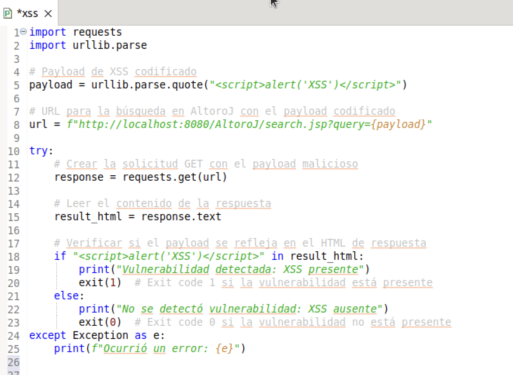

## Introducción

En este practico, se automatizaron dos pruebas de regeresión para validar la existencia de las vulnerabilidades de SQL Inyection y Cross-Site Scripting en la página de AltoroJ.

### Pasos para ejecutar los scripts

1. **Tener Python instalado.**
Si no se tiene Python instalado, se puede instalar utilizando los siguientes comandos:
```
sudo apt update
sudo apt install python3
```

2. **Instalar la biblioteca requests.**
El script utiliza la biblioteca requests para realizar solicitudes HTTP. Si no la tienes instalada, puedes hacerlo con el siguiente comando:
```
pip3 install requests
```

3. Tener el código de AltoroJ funcionando.  Asegúrarse de tener el servidor tomcat prendido.

4. Crear un archivo Python en Eclipse. Puede ser en una nueva carpeta de test como se muestra en la imagen.


5. Ingresar el contenido del script.

6. Ejecutar el script e interpretar el resultado. Para ejecutar el test, se recomienda utilizar External tools configurations como se muestra en la siguientes imagenes.


## Prueba 1: Inyección SQL en login


En este script, se hace un POST request a la url de login, cargando un payload para explotar la vulnerabilidad de SQL inyection. En caso de que el login sea exitoso, la vulnerabilidad está presente y se devuelve el código de salida 1. En caso contrario, se devuelve el código de salida 0.

Los datos a incluir en el payload se obtienen del archivo login.jsp, en donde se visualizan las variables _uid_ y _passw_ correspodientes al nombre de usuario y contraseña, que se enviaran al servidor para realizar el login.


**Caso 1: Vulnerabilidad presente**

En caso de que la vulnerabilidad esté presente, se muestra el siguiente mensaje por consola y se devuelve el código de salida 1.


**Caso 2: Vulnerabilidad ausente**

En caso de que la vulnerabilidad esté mitigada, se muestra el siguiente mensaje y se devuelve código de salida 0.


## Prueba 2: Cross-Site Scripting (XSS)



En este script, se hace un GET request a la url de búsquedas, ingresando un payload en el paramétro query para explotar la vulnerabilidad de Cross-Site Scripting. En caso de que el contenido del payload esté en el texto de la respuesta, la vulnerabilidad está presente y se devuelve el código de salida 1. En caso contrario, se devuelve el código de salida 0.

**Caso 1: Vulnerabilidad presente**

Si el script detecta la vulnerabilidad de XSS, mostrará el siguiente mensaje en la consola:


Esto indica que la vulnerabilidad aún está presente en el sistema y el código de salida será 1.

**Caso 2: Vulnerabilidad ausente**

Si no se detecta la vulnerabilidad para el caso ingresado en el payload, el script mostrará este mensaje:


Esto significa que el sistema ha mitigado correctamente la vulnerabilidad de XSS y el código de salida será 0.
