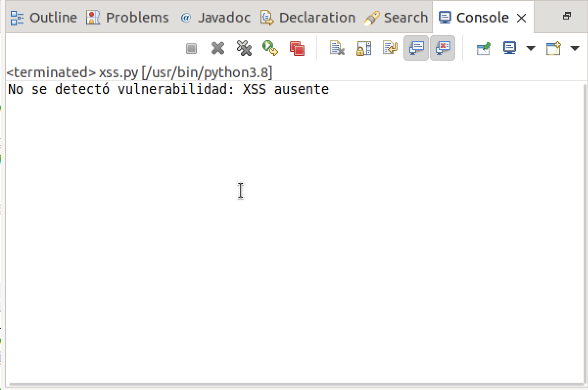

### Pasos para ejecutar los scripts

1. **Tener Python instalado.**
Si no tienes Python instalado, puedes instalarlo utilizando los siguientes comandos:
```
sudo apt update
sudo apt install python3
```

2. **Instalar la biblioteca requests.**
El script utiliza la biblioteca requests para realizar solicitudes HTTP. Si no la tienes instalada, puedes hacerlo con el siguiente comando:
```
pip3 install requests
```

3. Tener el código de AltoroJ funcionando.  Asegúrate de tener el servidor tomcat prendido.

4. Crear un archivo Python en Eclipse.

5. Ingresar el contenido del script.

6. Ejecutar el script e interpretar el resultado. Para ejecutar el test, se recomienda utilizar External tools configurations.


## Prueba 2: Cross-Site Scripting (XSS)


**Caso 1: Vulnerabilidad presente**

Si el script detecta la vulnerabilidad de XSS, mostrará el siguiente mensaje en la consola:


Esto indica que la vulnerabilidad aún está presente en el sistema y el código de salida será 1.

**Caso 2: Vulnerabilidad ausente**

Si no se detecta la vulnerabilidad para el caso ingresado en el payload, el script mostrará este mensaje:



Esto significa que el sistema ha mitigado correctamente la vulnerabilidad de XSS y el código de salida será 0.
